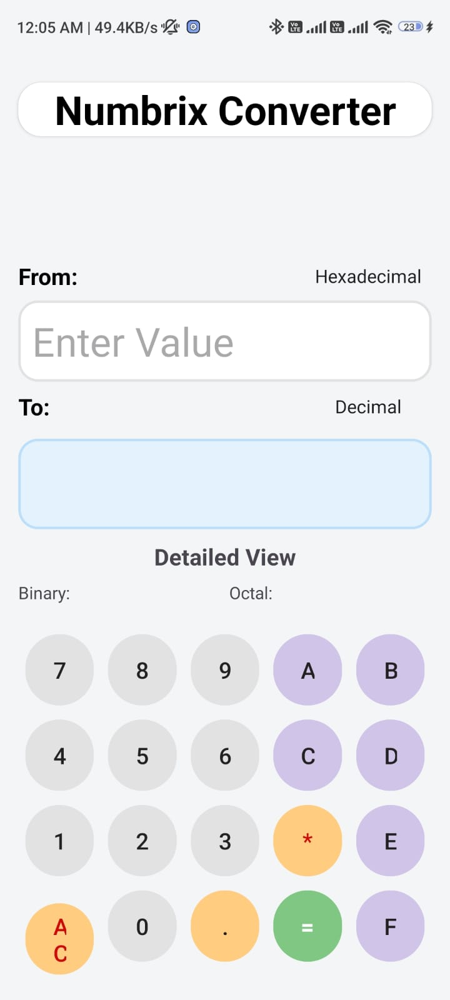
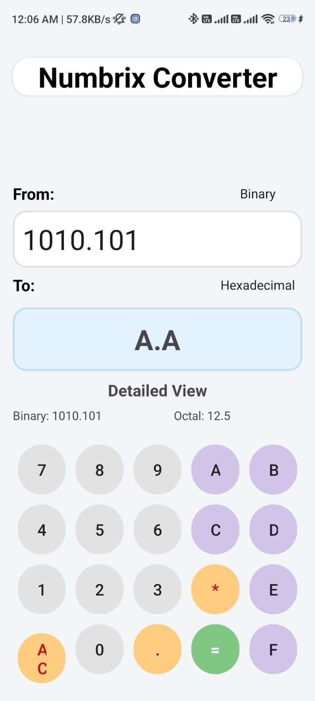
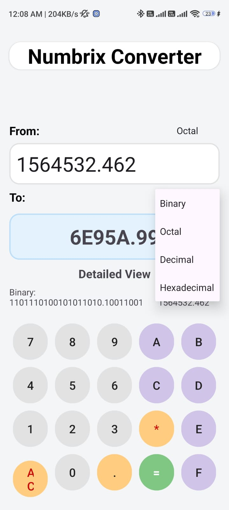

🔢 Number System Converter

A simple and efficient application that converts numbers between different numeral systems, including Binary, Decimal, Octal, and Hexadecimal. This project demonstrates the implementation of number system conversion algorithms with an easy-to-use interface.

📖 Overview

The Number System Converter helps users quickly convert numbers from one base to another. It is useful for students, programmers, and anyone learning computer fundamentals or digital electronics.

Supported number systems include:

- Binary (Base-2)
- Octal (Base-8)
- Decimal (Base-10)
- Hexadecimal (Base-16)

✨ Features

- 🔄 Convert between Binary, Decimal, Octal, and Hexadecimal
- ⚡ Fast and accurate conversions
- 🖥️ Simple and user-friendly interface
- 📚 Ideal for learning number systems
- 💡 Lightweight and easy to use

🛠️ Technologies Used

  Android Studio
  Java
  XML
  Android SDK
  Material Design Components
  View Binding

📌 Supported Conversions

From| To
Binary| Decimal
Binary| Octal
Binary| Hexadecimal
Decimal| Binary
Decimal| Octal
Decimal| Hexadecimal
Octal| Binary
Octal| Decimal
Octal| Hexadecimal
Hexadecimal| Binary
Hexadecimal| Decimal
Hexadecimal| Octal
📍with floating valve 

🧠 How It Works

1. Select the input number system.
2. Enter the number.
3. Choose the target number system.
4. Click Convert.
5. The converted value is displayed instantly.

---

📷 Screenshots

  
  
  

🎯 Applications

- Computer Science education
- Digital Electronics
- Programming practice
- Data representation learning
- Number system conversion

📥 Download APK

[⬇️ Download APK](https://github.com/ramdhansaini/Number-System-Conveter/releases/download/v1.0.1/app-debug.apk)

👨‍💻 Author

Ramdhan Saini

GitHub: https://github.com/ramdhansaini

⭐ Support

If you found this project useful, please give it a ⭐ Star on GitHub. Your support helps improve and maintain the project.
